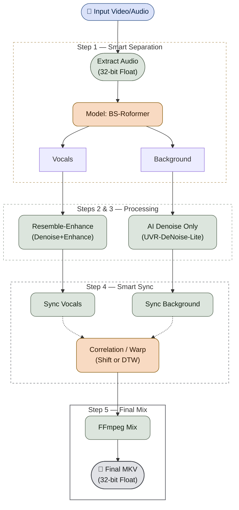
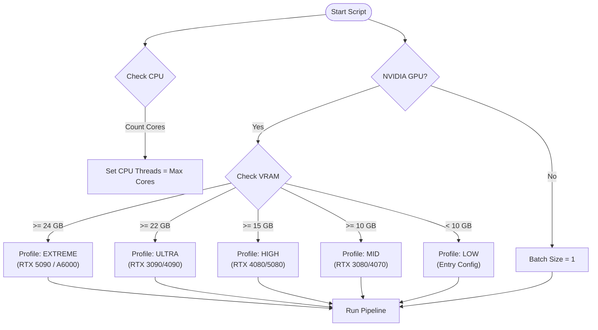

<div align="center">
  
</div>

# AI Hybrid VHS Audio Restorer

 

## Documentation
- [README.md](file:///c:/Users/ventu/Projects/AI-Hybrid-VHS-Audio-Restorer/README.md) - General overview and usage.
- [.agent/instructions.md](file:///c:/Users/ventu/Projects/AI-Hybrid-VHS-Audio-Restorer/.agent/instructions.md) - Technical guide for AI agents and developers.
- [docs/pipeline_logic.md](file:///c:/Users/ventu/Projects/AI-Hybrid-VHS-Audio-Restorer/docs/pipeline_logic.md) - Detailed pipeline schema.

## 🛠️ Restoration Pipeline
A specialized audio restoration pipeline designed to remaster VHS recordings.

## The Pipeline

This project uses a hybrid AI approach to separate, clean, and remix audio:

1.  **Separation**: Uses `audio-separator` with the **BS-Roformer-Viperx-1297** model to split audio into Vocals and Background. The **Lossless Background** method (Original - Vocals) ensures ambient sounds like birds and nature are preserved 100%. Outputs are explicitly named `(Background)` to avoid confusion.
2.  **Vocal Enhancement**: Runs **Resemble-Enhance** on the vocal track to remove muffle/hiss, restore high frequencies, and improve clarity.
3.  **Background Denoising**: Runs `audio-separator` with the **UVR-DeNoise-Lite** model on the background track to gently remove tape hiss while preserving the full dynamic range of nature/ambient sounds.
4.  **Smart Sync**: Corrects timing drift (wow/flutter) using two methods:
    - `shift` (Default): Global delay correction (Cross-Correlation). Glitch-free & Fast.
    - `dtw`: Dynamic Time Warping. Corrects variable drift (wow/flutter).
    *   **Hybrid GPU/CPU Engine**: Calculates the massive Distance Matrix on **NVIDIA RTX GPUs** (via PyTorch) and aligns paths on the CPU for maximum performance.
    *   **High Precision**: Defaults to 100Hz analysis (10ms accuracy) or 40Hz (25ms).
5.  **Mixing**: Recombines the clean vocals and denoised background using **FFmpeg** for a balanced, high-fidelity **32-bit PCM** output.

### ✨ Key Features
- **Robust Resume**: Automatically detects existing output files for every step. If you crash or stop the script, simply run it again—it will skip all finished work and resume instantly where it left off.
- **Local Temp Files**: Creates hidden temporary folders (e.g., `.temp_work_video_name`) right next to your input file, ensuring your project root stays clean. Auto-deletes on success.
- **Windows-Ready**: Optimized for standard Windows terminals (cmd/PowerShell) with strict 80-column log formatting to prevent wrapping.



## Requirements

The installer handles everything, ensuring compatibility with modern hardware:
- **Python 3.10+** (in a local venv)
- **FFmpeg 6.1+** (Full Portable Build included & configured)
- **PyTorch 2.x Nightly** (Required for RTX 50-series/Sm_120 support)
- **Audio-Separator** (BS-Roformer & UVR-DeNoise models)
- **Resemble-Enhance** (Windows-Patched for vocal restoration)
- **Runtime Patcher**: Automatically fixes `torchaudio` incompatibility and `deepspeed` crashes on Windows.

## Hardware Auto-Detection Logic

The script automatically scales performance based on your GPU VRAM:

| Profile | VRAM | Example GPUs | Batch Size |
| :--- | :--- | :--- | :--- |
| **EXTREME** | ≥ 24 GB | RTX 5090 / A6000 | 32 (+ Parallel Chains) |
| **ULTRA** | ≥ 22 GB | RTX 3090 / 4090 | 16 (+ Parallel Chains) |
| **HIGH** | ≥ 15 GB | RTX 4080 / 5080 | 8 |
| **MID** | ≥ 10 GB | RTX 3080 / 4070 | 4 |
| **LOW** | < 10 GB | Entry Level / Older Cards | 1 |

> [!TIP]
> **Smart OOM Recovery**: If an operation fails (GPU or CPU memory pressure), the script automatically retries with reduced settings:
> - **GPU steps**: Halves the batch size until success
> - **CPU steps (FFmpeg)**: Halves the thread count until success

> [!NOTE]
> CPU threads are automatically set to your maximum available cores (e.g., 32 threads for Ryzen 9950X3D).




## ⚙️ Configuration

The application uses a `config.yaml` file for easy customization. A default configuration is automatically loaded if the file doesn't exist.

### **Default `config.yaml`:**
```yaml
# Audio Mix Levels (0.0 to 1.0 or higher)
vocal_mix_volume: 1.0
music_mix_volume: 1.0

# Supported Video Extensions
extensions:
  - .mp4
  - .mkv
  - .avi
  - .mov

# Synchronization Method
sync_method: "shift"     # 'shift' (default) or 'dtw' (correction for wow/flutter)
dtw_resolution: 100      # Analysis resolution in Hz (lower = faster)

# Processing Mode
process_mode: "hybrid"   # 'hybrid' (Separation+Enhance) or 'denoise_only' (Faster, Transparent)
```

## Usage

1.  Run `install_dependencies.ps1` to set up the environment.

### Option A: Drag & Drop (Recommended)
Simply **drag and drop** your video file(s) or a folder containing videos directly onto `start.bat` (or the Python script). 
*   **Output**: The restored video will be saved in the **same folder** as your original video.

### Option B: Interactive Mode (Default)
Double-click `start.bat` without any files.
- The script will Launch and show your System Stats.
- Press **Enter** to automatically scan and process all files in the `input` folder.
*   **Output**: The restored videos will be saved in the **same folder** as the original videos.

### Option C: CLI
Run via command line with arguments:
```powershell
python restore_audio_hybrid.py "C:\Path\To\Video.mp4"
```
*   **Output**: The restored video will be saved in the **same folder** as the input video.

3.  Find the restored videos in `output`.

## Development & Testing

### Code Structure
The project is organized into a modular package structure:
- `modules/`: Core logic package.
  - `config.py`: Configuration loading.
  - `utils.py`: Utility functions (logging, validation).
  - `hardware.py`: Hardware detection and profile selection.
  - `sync.py`: Audio synchronization engines (Shift, DTW).
  - `processing.py`: Main audio processing pipeline steps.
  - `ui.py`: Terminal UI and file scanning.
- `restore_audio_hybrid.py`: Main entry point (calls `modules.processing`).

### Code Quality
- **Linting**: `flake8` (max-line-length=127, max-complexity=15).
- **Type Checking**: `mypy`.
- **Complexity**: Monitored with `radon`.

### Testing
Tests are run using `pytest` with `pytest-cov`.
```powershell
pytest --cov=. --cov-report=term
```
Local test runs automatically update the `Coverage` badge. Detailed summaries are available in CI job summaries.

### Coverage Goal
The project enforces a **mandatory 90% minimum code coverage**. The CI pipeline will fail if coverage drops below this threshold.

## Credits

- **Audio-Separator**: [beveradb/audio-separator](https://github.com/beveradb/audio-separator)
- **Resemble-Enhance**: [resemble-ai/resemble-enhance](https://github.com/resemble-ai/resemble-enhance)
- **FFmpeg**: [ffmpeg.org](https://ffmpeg.org/)